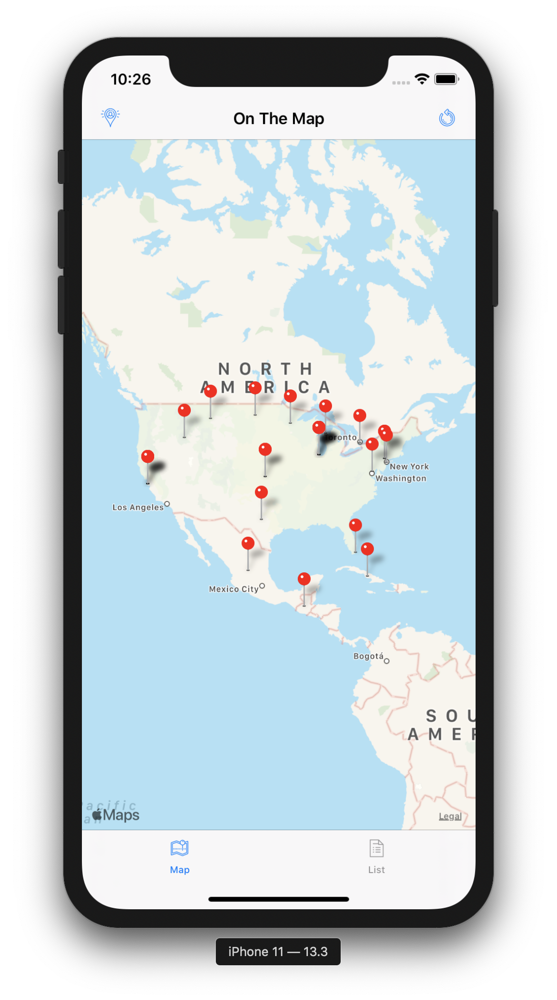
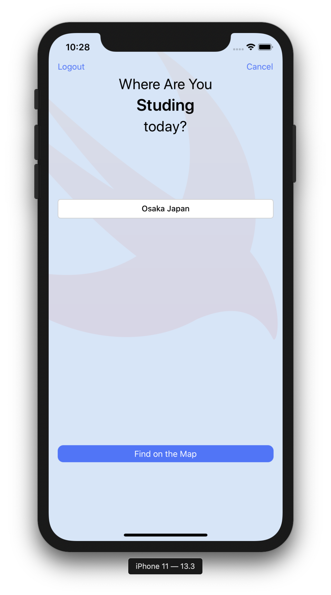

# OnTheMap

**On the map** is  application for pining student location on the map and have url to the pin which are user interactable and show detail and list view of the student information.

## Video Walkthrough 

Here's a walkthrough of implemented user stories:

Submitted by: **Mayuresh Rao**

1. Swift 5 
2. Xcode 11.3.1 
1. UIkit Framework.
2. Mapkit framework.
3. CoreLocation.

## The app has three view controller scenes:

<u> **Login View:** </u>

Allows the user to log in using their Udacity credentials.</u>

<u> **Map and Table Tabbed View:** </u>

Allows users to see the locations of other students in two formats.  

 

<u> **### Information Posting View:** </u>

Allows the users specify their own locations and links.

 

## User Stories

The following **required** functionality is complete:

* [x] User can login via udacity credentials.
* [x] User is shown tabbed view consisting of mapView and tableview.
* [x] User can tap in the pin preivew for user profile and name is shown.
* [x] User can view the list of the students on the tableview where the user name and profile link is presented to the use.
* [x] In TableView listed user if taps on pin image mapview is opened
* [x] In TableView listed user if tapped on media url opens the users profile in safari.
* [x] User can logout in the  Information porting View.

The following features are implemented:

## Future implementation
The following features can be implemented in the current project:
* [x] Add Facebook Login API

